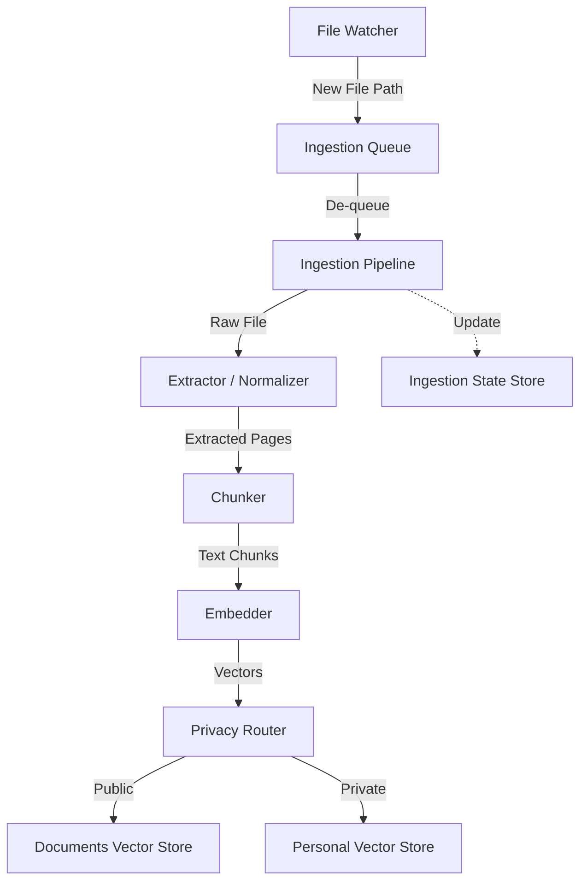

# Phase 1 Runtime Interaction

This document describes how the ingestion components interact during the Phase 1 runtime to transform local files into searchable vector embeddings.

## Overview

The ingestion pipeline is a multi-stage process that monitors the filesystem, extracts text, cleanses it, breaks it into semantic chunks, generates embeddings, and stores them in specialized vector tables.

## Core Components

### 1. File Watcher (`watcher.py`)
- **Responsibility:** Monitors configured directories (`WATCH_DIRS`) for filesystem events (creation, modification).
- **Filtering:** Only processes files with allowed extensions (PDF, MD, TXT, DOCX).
- **Debouncing:** Uses a 2-second cooldown to avoid processing transient file states during writes.
- **Deduplication:** Checks the `IngestionStateStore` hash before queueing to ensure the file hasn't already been processed.

### 2. Ingestion Pipeline (`pipeline.py`)
- **Responsibility:** The central orchestrator running as a background service.
- **Concurrency:** Uses a thread-safe `Queue` and a dedicated worker thread to process files asynchronously from the watcher.
- **Workflow:** Manages the sequential hand-off between extraction, chunking, embedding, and storage.

### 3. Extractor & Normalizer (`pdf_extractor.py` & `text_normalization.py`)
- **Extraction:**
    - `PDFExtractor` handles multi-page PDF files.
    - Markdown, Text, and Word files are read and wrapped into `ExtractedPage` objects.
- **Normalization:** Applies `full_normalization` which:
    - Strips non-printable characters.
    - Normalizes newlines (max 2 consecutive).
    - Collapses redundant whitespace.

### 4. Chunker (`chunker.py`)
- **Responsibility:** Breaks down large text blocks into smaller, semantically coherent chunks.
- **Metadata:** Attaches source file info, page numbers, and structural context (e.g., Markdown headers).
- **Classification:** Heuristically determines the `domain` (e.g., "religion", "personal", "general") and `content_type` (e.g., "transcript", "note").

### 5. Embedder (`embedder.py`)
- **Responsibility:** Transforms normalized chunk text into high-dimensional numerical vectors.
- **Batching:** Processes multiple chunks in a single batch to improve performance.

### 6. Vector Store (`vector_store.py`)
- **Responsibility:** Persistent storage for vectors and their associated chunk metadata.
- **Isolation:** Operates two distinct stores:
    - **Documents Store:** For general knowledge and public files.
    - **Personal Store:** For sensitive "personal" or "religion" domain content.

### 7. Ingestion State Store (`state.py`)
- **Responsibility:** Tracks the state of the ingestion process.
- **Persistence:** Records file paths and content hashes (`SHA-256`) to guarantee idempotency and prevent redundant re-processing of unchanged files.

## Data Flow Summary

1. **Detection:** `FileWatcher` detects a change and puts the path into the `Queue`.
2. **Extraction:** `IngestionPipeline` picks up the path, computes a hash, and extracts `ExtractedPage` objects.
3. **Chunking:** `Chunker` converts pages into `Chunk` objects with metadata.
4. **Embedding:** `Embedder` generates vectors for each chunk.
5. **Routing & Storage:** `IngestionPipeline` inspects the `domain` of each chunk.
    - If domain is `personal` or `religion`, it is saved to the **Personal** vector store.
    - Otherwise, it is saved to the **Documents** vector store.
6. **Finalization:** The file hash is recorded in `IngestionStateStore`.
